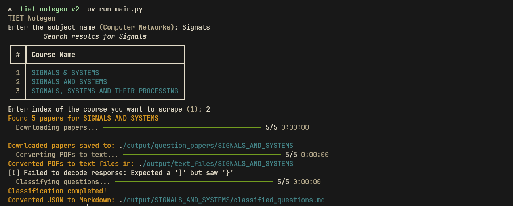

# TIET Notegen
TIET Notegen is a lightweight tool that scrapes [Thapar University's Question Paper Archive](https://cl.thapar.edu/ques.php) for past exam papers of a given course and intelligently classifies the questions into structured topics using the Gemini API.

 

## Examples
A few example PDFs generated by TIET Notegen:
- [Data Structures and Algorithms](./examples/DATA_STRUCTURES_AND_ALGORITHMS.pdf)
- [Computer Networks](./examples/COMPUTER_NETWORKS.pdf)
- [Probability and Statistics](./examples/PROBABILITY_AND_STATISTICS.pdf)

### Features
- 🔍 Automated Scraping – Fetches question papers directly from Thapar's official site based on course name.
- 🧠 Smart Classification – Uses Google's Gemini API to organize questions by topic, rephrasing incomplete or diagram-based questions as needed.
- ♻️ Deduplication & Cleanup – Merges similar topics, removes duplicates, and outputs clean, study-ready JSON.
- 🗂️ Study-Friendly Output – Generates a topic-wise breakdown of questions for easy revision and content structuring.

### Usage
1. Install the required dependencies:
   ```bash
    # pip
    pip install -r requirements.txt

   # uv
   uv add -r requirements.txt
   ```
2. Set up your Gemini API key in the `.env` file:
   ```plaintext
   GEMINI_API_KEY=your_api_key_here
   ```
3. Run the script to generate notes for a specific course:
   ```bash
    # python
    python main.py

   # uv
   uv run main.py
   ```
